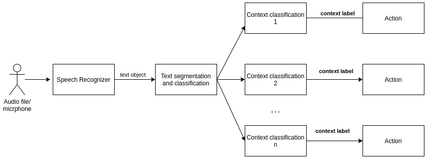

# Assistente Pessoal - Projeto Open Source

Projeto open source de um assistente pessoal que pode ser utilizado no contexto
de qualquer usuário, codificando-se os módulos sob demanda, de modo a criar um
assistente de propósito específico para as necessidades do cliente.

Autor: Matheus Lemos <matheuslemosf@gmail.com>

## Instalacão

O programa tem os seguintes requisitos

- virtualenv
- SpeechRecognition
- pocketsphinx
- pyaudio

O programa pode ser instalado dentro de um ambiente virtual Python. Caso se deseje
utilizar o programa em escopo de sistema, ignore a parte de criacão do ambiente virtual.
Para instalar as dependências basta executar os comandos

	virtualenv personal-assistant
	cd personal-assistant/
	source bin/activate

Após instalado o ambiente, baixe o repositório e execute o arquivo **main.py**

	git clone repo
	cd src/
	python main.py

## Estrutura do projeto

O assistente terá diferentes módulos, que serão chamados a medida que for detectada
uma certa "intencão" presente no texto. Por exemplo, se o programa detectar intencão
de "lista de compras", o módulo apropriado será chamado, de forma a realizar a 
classificacão do texto em um escopo limitado:

